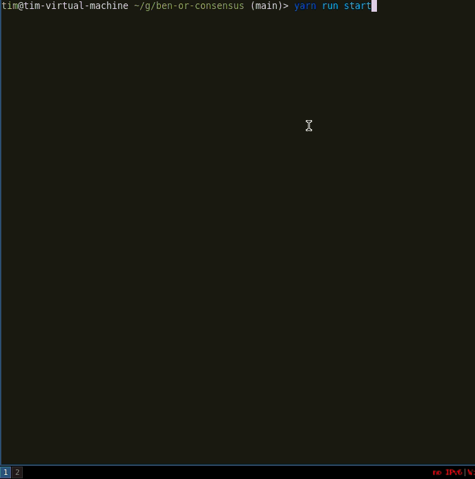

## The Ben-Or decentralized consensus algorithm

The *Ben-Or consensus algorithm* is making use of **randomness** to create consensus in a asynchronous network with eventual liveness guarantee.

This repository contains my TypeScript implementation of the Ben-Or consensus algorithm, designed to run on a single machine. It's for anyone looking to learn more about this algorithm from a hands-on perspective.

---

## Example Run

Example Configuration:

```
?: no init value
H: Non-Faulty
F: Faulty
Nodes:          F F F F H H H H H H
Init Values:    1 1 1 1 ? 1 0 1 0 1
```

Run:



See [start.ts](src/start.ts) for the details

---

## How to test the code 

1. Run the unit tests with the command `yarn test` and see how the implementation performs against the given tests
1. Modify the `start.ts` file with the parameters you'd like, launch the network manually with `yarn start` and see the results

---

## Algorithm Details

### Intuition of the algorithm

1. At first every process proposes their input value. 
1. After that, they propose random values.
1. **When enough processes propose the same value, the value is chosen.**
1. Eventually, that will happen!

### Setup

1. Protocol proceeds in **asynchronous rounds**, where each round has **two** phases.
    1. In the first phase of a round, each node tries to identify a value supported by a majority in order to propose that for the second phase.
    1. In the second phase (the decision phase), a node finalizes its decision if it finds the same value proposed by at least *f+1* nodes. 
1. For each phase, processes broadcast their input values and wait for *n - f* messages from the other processes.
1. Each message is tagged with the round and phase number. (And messages can be resent to deal with a lossy network. But once a message is sent, that value is **locked** in for that process for that phase/round.)

### Guarantees

1. Deterministic Safety by majority intersection
1. Termination with probability 1

### Pros and Cons 

Pros:

1. Processes without input values start by proposing *⊥*

Cons:

1. Performance is not predictable.
1. Convergence can still take multiple rounds.
1. Amount of communication needed is potentially high.

### Assumptions

1. Node Failure Mode: crash-stop start from round 0 
1. Message sent will eventually be received in arbitrary order; No message lost 

### REST API

- Nodes listen to request on the port defined by `BASE_NODE_PORT` + nodeId, which for the basic configuration, means that node #0 will have the port 3000, #1 the port 3001, etc,
- Nodes always start with an initial state that is provided as a parameter of the `node` function,
- Nodes communicate through POST HTTP request with the `/message` route which you should implement,
- Nodes should start the algorithm when they receive a GET HTTP request to the `/start` route,
- if the `/stop` GET HTTP route is called on a node, it should stop any activity (this is to prevent any errors in the tests),

---

## References

1. Asynchronous Agreement Part Two: Ben-Or's protocol - https://decentralizedthoughts.github.io/2022-03-30-asynchronous-agreement-part-two-ben-ors-protocol/
1. Lecture CSE2 G20 Randomized consensus - https://courses.cs.washington.edu/courses/cse452/19sp/slides/l13-benor.pdf
